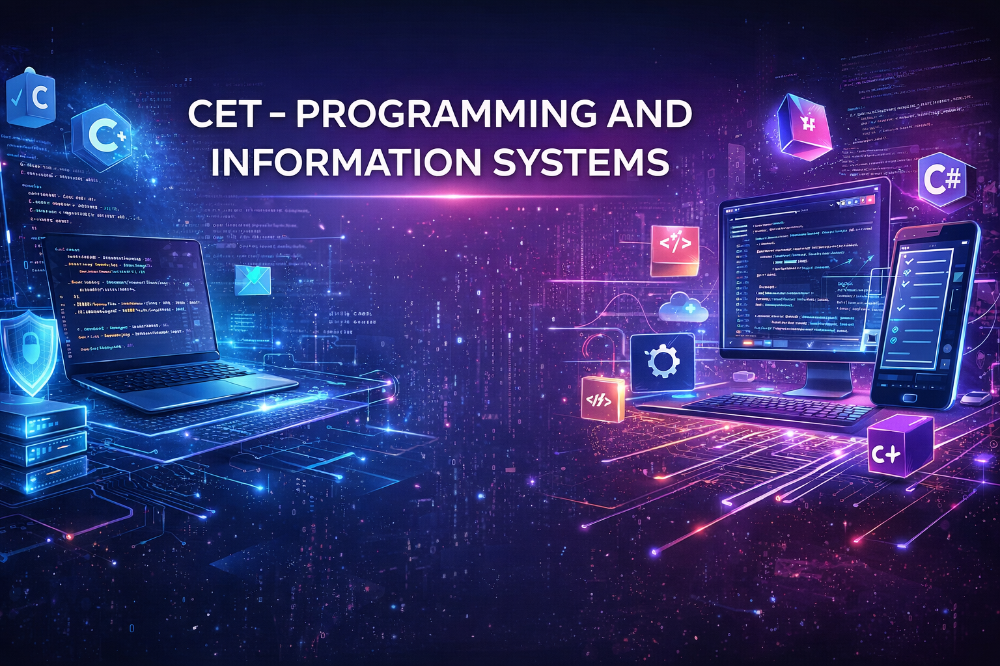

  

<h1 align="center">
CET – Programming and Information Systems
</h1>

Portfolio of projects developed during the CET course

---

# 👨‍💻 About this Repository

This repository documents my learning journey through the **CET – Programming and Information Systems** course.

It contains projects, exercises and experiments developed while studying:

- Software Development
- Web Development
- Databases
- Mobile Development
- System Integration
- Networking and Security

The goal is to **demonstrate practical programming skills and problem-solving ability through real code.**

---

# 🧠 Technical Focus

This portfolio reflects a **hands-on technical approach** focused on:

✔ solving problems  
✔ simplifying complex processes  
✔ building efficient systems  
✔ continuous improvement  

---

# 🛠 Technologies & Tools

| Programming | Web | Databases | Tools |
|--------------|------|-----------|------|
| C | HTML | SQL | Git |
| C++ | CSS | NoSQL | GitHub |
| C# | JavaScript | MySQL | Linux |
| Java | React | MongoDB | Docker |

---

# 📚 Course Modules

## 💻 Programming Fundamentals

- Algorithms and logic
- Structured programming
- Complex program development
- Object-oriented programming

Languages used:

C
C++
C#
Java
---

# 🌐 Web Development

### Frontend
- HTML
- CSS
- JavaScript
- Responsive interfaces

### Backend
- Server-side programming
- API integration
- Database communication

Frameworks used:
React

---

# 🗄 Databases

### Relational Databases

- Data modelling
- SQL queries
- Database normalization

Technologies:
MySQL
PostgreSQL

---

### NoSQL Databases

- Integration with modern applications
- Scalable data storage

Examples:
MongoDB
Firebase

---

# 📱 Mobile Development

Android mobile applications development including:

- UI components
- Data persistence
- API consumption

---

# 🔐 Cybersecurity

Topics covered:

- Security policies
- Secure system design
- Best practices for software security

---

# 🌐 Networking

- Data communication networks
- System configuration
- Network troubleshooting

---

# 🔗 Version Control

Tools used:
Git
GitHub

Concepts:

- Branching
- Pull Requests
- Collaboration workflows

---

# 🧩 System Integration

Development of integrated systems including:

- API communication
- Data integration
- Multi-system architectures

---

# 📂 Repository Structure
CET-Programming-Systems/

algorithms/
structured-programming/
oop/
web-frontend/
web-backend/
react/
databases-sql/
databases-nosql/
mobile/
csharp/
system-integration/
security/
projects/

---

# 📊 Learning Roadmap
Algorithms
↓
Structured Programming
↓
Object Oriented Programming
↓
Databases
↓
Web Development
↓
Mobile Development
↓
System Integration

---

# 💡 Example Projects

Examples included in this repository:

- CLI tools in C
- Data processing scripts
- Web applications
- Database systems
- API integrations
- Mobile apps
- Full stack experiments

---

# 📈 Continuous Learning

This repository will grow with:

- new projects
- new experiments
- new technologies

The goal is to **build a strong technical portfolio.**

---

# 👤 Author

**Adriano Valente**

Technical profile focused on simplifying processes and building efficient solutions.

💡 Hands-on mindset  
🔍 Problem solving approach  
⚙️ Process improvement focused

---

# ⭐ If you find this repository interesting

Consider giving it a **star ⭐**
